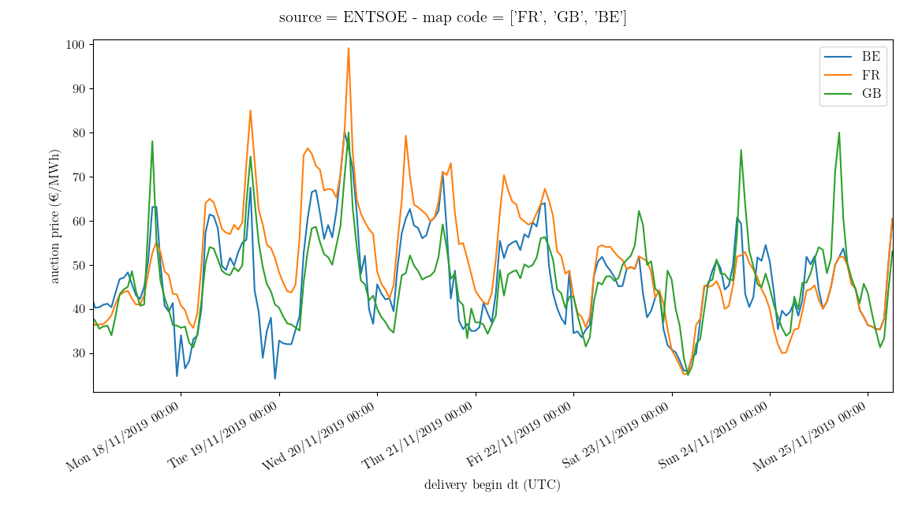
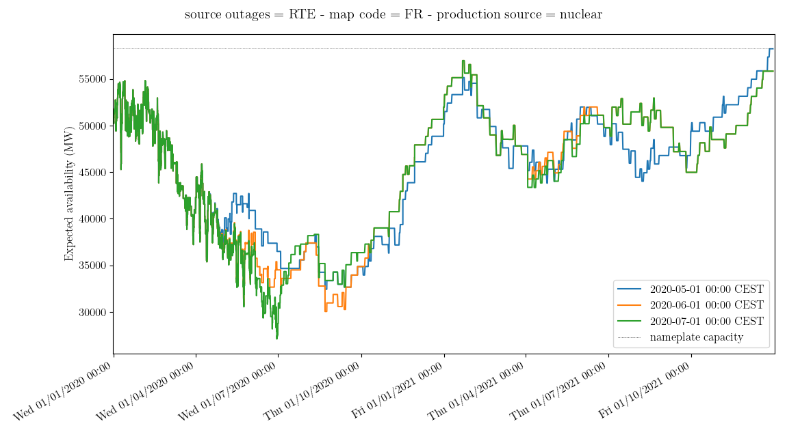
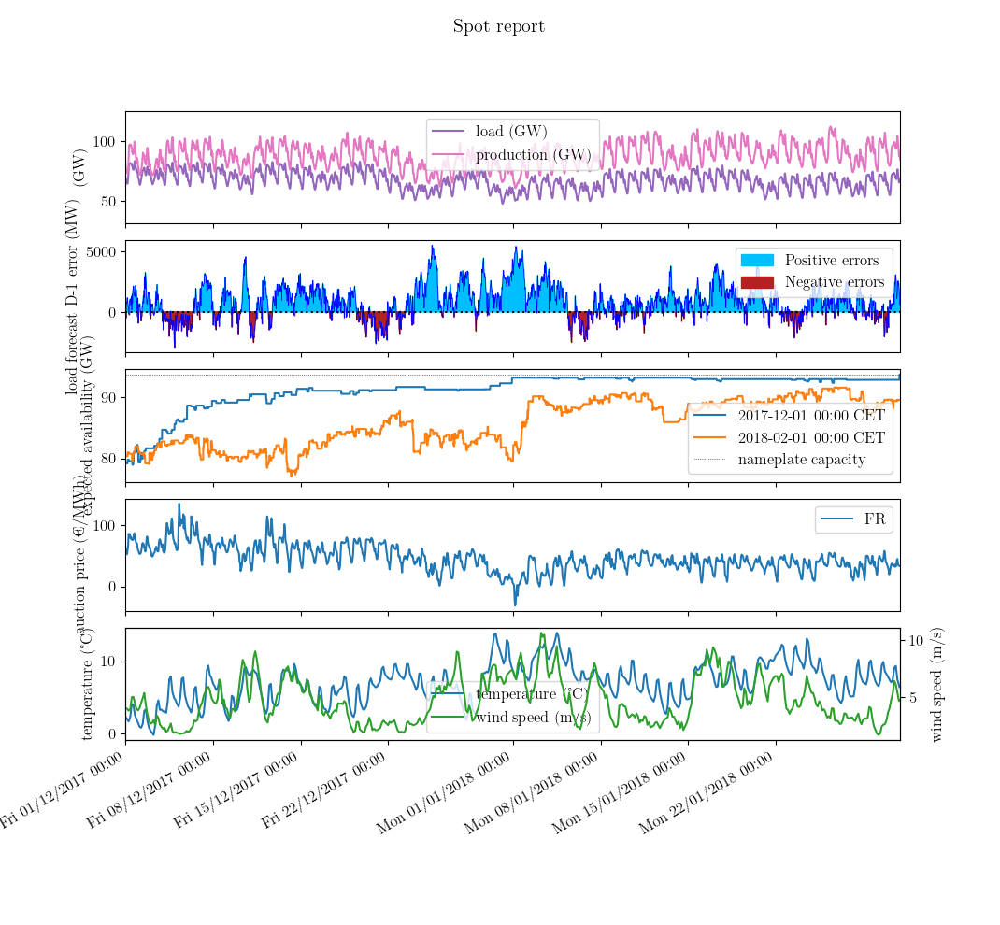

# Presentation
A complete description of this project is given in ./documentation.pdf.
To obtain the proposed interactive visualizations, the user should :
* install the package, 
* download the input data,
* run one the scripts with ipython and her own choice of parameters.

# 1. Installation
It can be installed with :
```
cd ~/Downloads
git clone https://github.com/cre-os/energy-data-visualization.git
cd energy-data-visualization
conda create --name visu python=3.8 pip
conda activate visu
pip install -e .
```
The installation can then be tested with one of the following :
```
python _scripts/weather/main_curve.py
```
or 
```
python _scripts/load/main_forecasting_error.py
```
The scripts should terminate without any error.
They will create 3 folders in ~/ : 
- one for the raw data,
- one for the transformed data,
- one for the plots.

However, ipython should then be preferred for interactive plots.

# 2. Download the input data
The data used for the visualizations proposed in this repository come from different public data sources.
only the data from eCO2mix and Météo-France are downloaded automatically.
Data from RTE and ENTSO-E should be downloaded manually.
They have to be stored as described in the documentation.
## eCO2mix
Data about the supply and demand equilibrium and provided by Réseau de Transport d’Electricité (RTE) through eCO2mix allows to illustrate the production and the consumption on the French electricity network.
They **can be downloaded automatically**.
No account is necessary.
## ENTSO-E
The European Network of Transmission System Operators for Electricity (ENTSO-E) publishes fundamental data on its transparency platform.
The source files used for the visualizations in this repository currently **have to be downloaded manually** with the SFTP share.
An account is necessary.
## Météo-France
As the French national meteorological service, Météo-France provides observation data extracted from the Global Telecommunication System (GTS) of the World Meteorological Organization (WMO).
The data **can be downloaded automatically**.
No account is necessary.
## RTE
RTE publishes fundamental data about the French electricity transmission system.
The files currently **have to be downloaded manually** on the platform RTE services portal.
An account is necessary.

# 3. How-to : examples
In this repository, we propose a set of modules that read, format and transform the input data from different public sources.
We also provide ready-to-run scripts with parameters therein that can be modified by the user as illustrated below.
The other possible visualizations are described in more details in the documentation.

## Auction prices

Having installed the package energy_data_visualization and downloaded the auction prices from the ENTSO-E platform as described in the documentation, this visualization is obtained by running scripts/auctions/main_prices.py in an IPython console.

## National production

This visualization is obtained by running scripts/production/main_power.py.
The data are downloaded automatically if the selected source for the input data is eCO2mix.
Otherwise, if the source is ENTSO-E or RTE, the data currently have to be downloaded manually.

## Load forecast

This visualization is obtained by running scripts/load/main_forecasting_error.py.
The data, coming from eCO2mix, are downloaded automatically.

## Distribution of the temperature

This visualization is obtained by running scripts/weather/main_distribution.py.
The data, coming from Météo-France, are downloaded automatically.

## Availability programs

This visualization is obtained by running scripts/outages/main_incremental_programs.py.
The data have to be downloaded manually from ENTSO-E or RTE platforms.

## Spot report

This visualization is obtained by running scripts/multiplots/main_spot_report.py.
As it mixes data from different sources, the data from ENTSO-E and RTE have to be downloaded manually.


